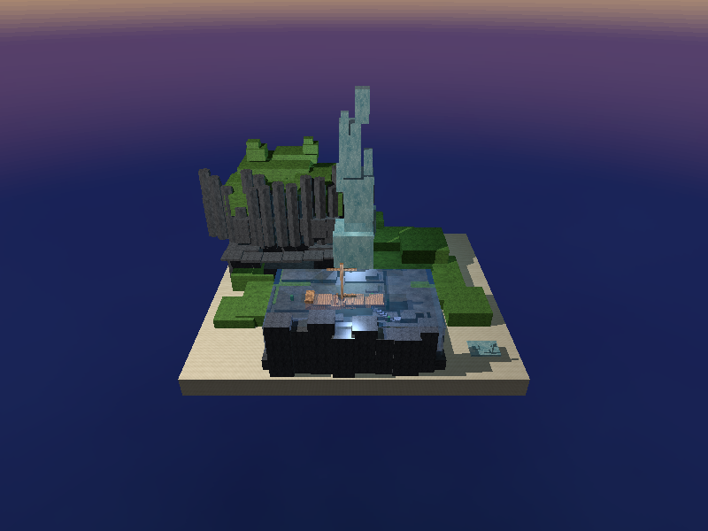

# El Continente Inacabado

Un diorama orbital con ray tracing, escrito en Rust. El Continente nace **sin
pintar** —todo de lienzo crudo— y se revela por regiones cuando alguien lo
pinta: praderas, rompeolas y una bahía suspendida. Cuando las tres están
completas, el Monolito se revela solo.

La obra está **inspirada en *Clair Obscur: Expedition 33***, que es su
referencia visual y conceptual. El nombre del videojuego no forma parte del
título ni del proyecto.



## Concepto y secuencia

Pintar **no crea, mueve ni destruye geometría**. La escena entera existe desde
el arranque en su posición final; lo único que cambia es qué material se ve,
interpolado entre el lienzo y el material final de cada objeto. Esa decisión
sostiene toda la arquitectura: como la revelación no toca la geometría, la
estructura de aceleración se construye una vez y no se invalida nunca.

El progreso vive centralizado en `RevealState`: **un `f32` por grupo**, cuatro
grupos. Los objetos son inmutables y no guardan su propio progreso.

| Estado | Qué se ve |
|---|---|
| `hero_canvas` | todo en lienzo |
| `hero_meadows` | Praderas pintadas |
| `hero_breakwater` | + Rompeolas |
| `hero_waters` | + Aguas Voladoras |
| `hero_final` | + el Monolito, que arranca solo |

El Monolito no se elige: `RevealState::activate` lo prohíbe hasta que las tres
regiones están pintadas, y el avance por tiempo lo arranca en el mismo tick que
completa la última.

## Controles

| Tecla | Acción |
|---|---|
| `←` `→` | orbitar en yaw |
| `↑` `↓` | orbitar en elevación |
| `W` `S` / rueda | acercar y alejar |
| clic | pintar la región señalada |
| `1` `2` `3` | pintar Praderas / Rompeolas / Aguas Voladoras |
| `L` | volver al lienzo y repetir la demostración |
| `R` | restaurar el encuadre hero |
| `Escape` | salir |

El teclado existe porque una presentación no puede depender de acertar un clic
sobre una bahía que ocupa el `2.4 %` del cuadro.

## Compilar y ejecutar

```bash
cargo run --release
```

Se abre una ventana de `800 × 600`. Al arrancar mide el tiempo por cuadro **en
esa máquina** y deriva de ahí la duración de la revelación; si el perfil no
diera para quince cuadros de transición, aborta con el motivo en vez de alargar
la animación.

### Las dos rutas de geometría

Los pilares del Rompeolas admiten dos formas, y las dos se compilan:

```bash
cargo run --release                         # Ruta A: prismas hexagonales (lo entregado)
cargo run --release --no-default-features   # Ruta B: cuboides verticales (respaldo)
```

`Cargo.toml` declara `default = ["hex-prism"]`. La Ruta B **no está
descartada**: se conserva como respaldo comprobable y los quality gates se
ejecutan en las dos configuraciones, porque revertir la decisión tiene que ser
una bandera y no un parche.

## Render sin ventana

`render_scene` produce PNG sin abrir ventana. Es lo que genera la evidencia y
lo que permite comparar dos renders sin depender de una captura de pantalla.

```bash
cargo run --release --bin render_scene -- \
  --preset safe-refractive-water --width 800 --height 600 \
  --reveal 1 --output evidence/hito8/hero_final.png
```

Banderas principales: `--preset`, `--width`, `--height`, `--yaw`,
`--elevation`, `--shading`, `--reveal`, `--paint`, `--benchmark`,
`--no-textures`, `--output`. Presets: `safe-refractive-water` —el canónico—,
`safe-interior-visible`, `safe-opaque-water`, `blockout` y `cubo`.

### `--paint`: un estado por región

`--reveal` aplica el mismo progreso a los cuatro grupos, así que por sí solo no
puede producir un PNG con una sola región pintada. `--paint` sí, y es
repetible:

```bash
# solo Praderas
cargo run --release --bin render_scene -- \
  --preset safe-refractive-water --paint meadows --output praderas.png

# Praderas y Rompeolas, acumulativo
cargo run --release --bin render_scene -- \
  --preset safe-refractive-water --paint meadows --paint breakwater --output dos.png
```

Grupos: `meadows`, `breakwater`, `waters`, `finale`. Lo nombrado queda en `1` y
lo demás en lienzo. No se combina con `--reveal`, rechaza nombres desconocidos
y repeticiones, y **`finale` exige nombrar antes las tres regiones**: el
Monolito se revela al completarse el Continente, no se elige.

## Arquitectura del raytracer

### Primitivas propias

No hay esferas ni mallas. La escena es **cuboides** y, en la Ruta A, **prismas
hexagonales**, los dos implementados a mano.

- **Cuboide**: intersección por slabs alineados a ejes, con la cara de entrada
  o la de salida según de qué lado venga el rayo.
- **Prisma hexagonal** (`src/hex_prism.rs`): regular, de eje vertical,
  resuelto por **ocho semiespacios** —seis laterales más dos tapas— como un
  intervalo `t_enter`/`t_exit`. Es la misma estructura que el cuboide con
  cuatro pares de planos en vez de tres. UV lateral por distancia sobre el
  perímetro, para que la textura dé la vuelta sin costura en cada arista.

`Primitive` es un `enum` y no `Box<dyn>`: la intersección está en el camino más
caliente —cientos de primitivas por rayo, medio millón de rayos por cuadro— y
un despacho dinámico ahí cuesta una indirección por prueba.

### Aceleración

Jerarquía estática de tres niveles: **escena → grupo espacial → cluster →
primitiva**. Siete grupos espaciales; el Rompeolas se parte en cuatro clusters,
uno por tramo contiguo del arco, para que ningún AABB quede lleno de aire. Los
hijos se recorren ordenados por `t_enter` y se podan contra el `closest_t`
actual.

### Materiales y luz

Cinco materiales finales más el lienzo: `canvas`, `water`, `wet_basalt`,
`aged_wood`, `meadow`, `pictorial_crystal`. Tres luces puntuales con *light
linking*: cada una declara a qué grupos ilumina y cuáles puede ocluir, así que
una luz que no afecta a un grupo no cuesta ni una operación.

Todo el cálculo ocurre en **espacio lineal**. Las texturas se decodifican de
sRGB al cargarlas y el píxel se vuelve a codificar al escribirlo.

### Sombras, reflexión y refracción

Las sombras tienen tres modos: opaca, ignorada y atenuada. El agua usa
`Ignore` a propósito —un volumen que proyectara sombra dura dejaría el interior
de la bahía negro—, y ese modo **nunca se interpola**: sale siempre del
material final.

El reparto de energía es Fresnel por Schlick, con el coseno tomado **del lado
menos denso**, y devuelve exactamente `1.0` en reflexión total interna. De ahí
salen tres pesos: reflejado, transmitido y local. La recursión tiene
`MAX_DEPTH = 3`, y un rayo que agota la profundidad devuelve el cielo, nunca
negro.

### Cielo

El skybox es una función de la dirección del rayo, no un objeto: dos panoramas
equirectangulares —pálido y pintado— que se mezclan con el progreso global.
`v = 0` es el nadir, `0.5` el horizonte y `1` el cenit.

### Interacción

Mientras algo se mueve se traza a `320 × 240` y se escala; al soltar los
controles se produce un cuadro final a `800 × 600`.

Eso obliga a una precaución con el ratón: el clic se resuelve contra la
**cámara y la resolución del cuadro que está en pantalla**, no contra las
actuales, y trunca al píxel fuente con el mismo mapeo que dibuja. El escalado
por vecino más cercano **trunca**, así que sin esto un clic podía elegir lo que
había un píxel al lado de lo que el usuario veía.

## Assets

Los ocho assets de `assets/` se **generan dentro del proyecto**. No hay
imágenes descargadas: no hay licencias de terceros que acreditar.

```bash
cargo run --release --bin generate_assets
```

| Archivo | Tamaño | Semilla |
|---|---|---|
| `assets/textures/canvas.png` | 256 × 256 | `0x0CA1_7A50` |
| `assets/textures/water.png` | 256 × 256 | `0x0A90_A900` |
| `assets/textures/wet_basalt.png` | 256 × 256 | `0x0BA5_A170` |
| `assets/textures/aged_wood.png` | 256 × 256 | `0x0DE0_71BA` |
| `assets/textures/meadow.png` | 256 × 256 | `0x6BA5_5A00` |
| `assets/textures/pictorial_crystal.png` | 256 × 256 | `0xC157_A100` |
| `assets/skybox/pale.png` | 1024 × 512 | `0x0A1E_0001` |
| `assets/skybox/painted.png` | 1024 × 512 | `0x0A17_7ED0` |

Ruido de valor en octavas, con los índices de la rejilla envueltos por
`rem_euclid`: el ruido es periódico por construcción y las texturas repiten sin
costura. **Con semilla fija, regenerar desde un clon limpio produce bytes
idénticos.** Los PNG se versionan porque son los que carga el renderer; el
generador se conserva como su fuente reproducible.

Si falta un asset, el programa **aborta con la ruta**. No hay fallback
silencioso a colores planos.

## Tests y quality gates

```bash
cargo fmt -- --check
cargo clippy --all-targets -- -D warnings
cargo clippy --all-targets --no-default-features -- -D warnings
cargo test                      # 436 tests
cargo test --no-default-features # 423 tests
cargo build --release
```

Los `13` de diferencia son los que solo existen en la Ruta A. La regla de
trabajo del proyecto es que **todo número verificable vive en un test**, para
que el código y la documentación no puedan divergir en silencio: los
presupuestos de primitivas por región, la geometría de las cámaras de
medición, las dimensiones del lote de densidad y la aritmética de la
revelación están fijados así.

## Evidencia

`evidence/hito8/` contiene los ocho PNG de la entrega: cinco estados de
revelación acumulativos y tres ángulos de órbita. `docs/evidence.md` registra
cada hito con sus mediciones, sus hashes y su procedencia.

Las carpetas `evidence/hito4` a `evidence/hito7` conservan la evidencia de los
experimentos anteriores, **incluidos los rechazados**: un candidato descartado
deja las imágenes que justifican su rechazo.

## Rendimiento

Medido en **Ryzen 7 6800H**, `rustc 1.97.0`, perfil release.

| | Valor |
|---|---|
| Perfil interactivo | `320 × 240` mientras algo se mueve |
| Cuadro en reposo | `800 × 600` |
| Peor cuadro interactivo medido | `0.1041 s` |
| Crítico del gate de fluidez | `0.2667 s` (quince cuadros en cuatro segundos) |
| Reserva | `2.56x` |

El presupuesto no se mide en un solo encuadre: se recorre una rejilla de
**cuarenta y ocho cámaras** —cuatro yaws × cuatro elevaciones × tres radios— y
se toma el peor. Medir solo la toma hero prometía un margen que el primer giro
se gastaba.

### Limitaciones metodológicas

Conviene decirlas, porque cambian cómo hay que leer las cifras:

- La rejilla de cuarenta y ocho encuadres es una **muestra** de un espacio
  continuo. Su peor celda es una cota inferior del peor cuadro real, no el
  máximo.
- Los tiempos absolutos **se mueven entre corridas** según el estado térmico:
  el suelo de la escena más barata varió un `16 %` en corridas del mismo día.
  Lo que reproduce son los cocientes dentro de una corrida.
- **No hay medición causal del coste de la Ruta A.** Las dos rutas se midieron
  en corridas seriales separadas, con una recompilación entre medias, porque
  cambiar de feature invalida el build. Lo que se puede afirmar es que están
  en el mismo orden de magnitud y que **las dos pasan el gate**; no un
  porcentaje concreto.
- `render()` no incluye el coste de presentar el cuadro ni de leer la entrada.

## Decisiones de alcance

- **Sin `rayon`.** Se evaluó y no se activó: el presupuesto se resolvió con
  resolución adaptativa y poda, no con hilos.
- **Sin mallas, fauna, personajes ni movimiento libre.** La cámara orbita; no
  se camina por la escena.
- **Sin caustics reales ni postprocesado.** El agua se resuelve con refracción
  y reflexión, no con simulación.
- **Densidad incremental.** Se probaron tres lotes de detalle y se conservó
  uno de dos primitivas. Los otros cabían en el presupuesto de tiempo y no
  compraban lectura: quince piezas submarinas cambiaban un `0.05 %` del cuadro
  que se presenta, porque el reflejo del agua domina esos píxeles.

## Limitaciones conocidas

- El gate de fluidez se cumple con el perfil `320 × 240`. Con `400 × 300` el
  peor encuadre alcanzable queda al filo del techo de cuatro segundos.
- La escena es un nivel fijo: no hay carga de escenas desde archivo.
- El nivel candidato de `162` primitivas existe como parámetro medible y **no**
  es lo que se envía; lo que se envía son `160`.
- El video de la entrega y la verificación en un clon limpio **no están
  ejecutados** en este repositorio.

## Estructura

```
src/
├── main.rs            ventana, entrada, autocalibración y dirty rendering
├── renderer.rs        cast_ray, recursión, perfiles interactivos
├── accel.rs           jerarquía grupo → cluster → primitiva
├── primitive.rs       el enum de formas trazables
├── cuboid.rs          intersección por slabs
├── hex_prism.rs       prisma hexagonal por ocho semiespacios (Ruta A)
├── optics.rs          reflexión, refracción, Fresnel y reparto de energía
├── reveal.rs          RevealState, fases y duración de la transición
├── input.rs           picking contra el cuadro presentado
├── camera.rs          órbita, zoom y generación de rayos
├── skybox.rs          panoramas equirectangulares
├── scenes/            el diorama por regiones
└── bin/
    ├── render_scene.rs     render headless a PNG
    └── generate_assets.rs  generador determinista de texturas
```

## Créditos

Proyecto académico del curso **cc2018 — Gráficas por Computadora**, UVG.
Referencia visual: *Clair Obscur: Expedition 33*. Todo el código y todos los
assets son propios.
